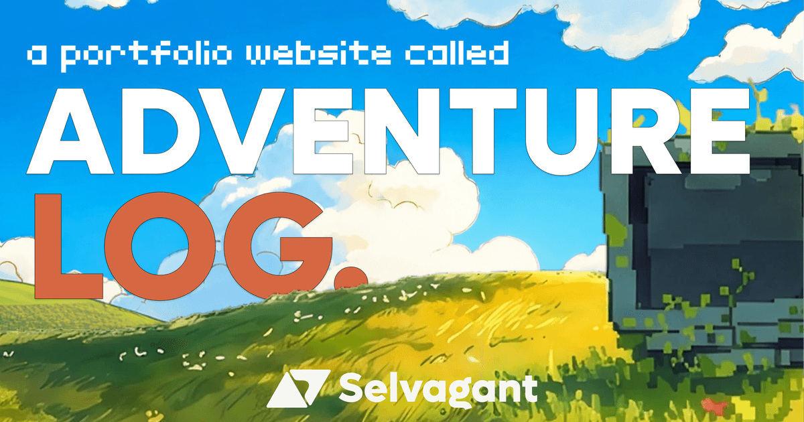

# 🧭 Adventure Log. — Digital Field Journal

<p align="center">
  
</p>

> **"A field journal where precision engineering meets organic exploration."**  
> Digital Field Journal & Expedition Portfolio of **Selvagant (Taki)** — Creative Developer, UI/UX Designer & Mobile Architect.

---

## 🛠️ Tech Stack & Architecture
- **Framework**: React 19 & Vite (TypeScript)
- **3D Interactive Stage**: Three.js (`HeroCompass3D` tactical cartographer compass)
- **Animation Engine**: GSAP (GreenSock) & ScrollToPlugin
- **Design Tokens & Styling**: Pure CSS Architecture (`src/styles/tokens.css`, `src/styles/global.css`, `src/styles/fonts.css`)
- **Typography**: `Lufga` (Editorial Display), `Newsreader` (Editorial Serif), & `JetBrains Mono` (Technical Telemetry)
- **Tactile Details**: Custom SVG Paper Grain Overlay & Interactive Target Cursor

---

## 📁 Project Structure
```
adventure-log/
├── public/
│   ├── fonts/           # Local font assets (Lufga, Hitobito, JetBrains Mono)
│   ├── images/          # Background landscapes & expedition mockups
│   ├── logo/            # Scalable SVG brand assets
│   ├── og-image.png     # 16:9 Social share preview card
│   ├── noise.svg        # Tactile paper grain filter
│   └── favicon.svg      # Expedition mark
├── src/
│   ├── assets/          # Static assets & icons
│   ├── components/      # Modular section components
│   │   ├── Preloader.tsx
│   │   ├── TacticalNav.tsx
│   │   ├── Header.tsx
│   │   ├── Hero.tsx
│   │   ├── HeroCompass3D.tsx
│   │   ├── About.tsx
│   │   ├── SelectedExpeditions.tsx
│   │   ├── FieldArsenal.tsx
│   │   └── Footer.tsx
│   ├── data/            # Structured content (expeditions, arsenal)
│   ├── hooks/           # Motion & telemetry reactive hooks
│   ├── styles/          # Design tokens & global CSS
│   ├── types/           # TypeScript domain interfaces
│   ├── TargetCursor.tsx # Tactical dynamic cursor
│   ├── App.tsx          # Master layout integration
│   └── main.tsx         # Application entrypoint
```

---

## 🚀 Getting Started

### 1. Install Dependencies
```bash
npm install
```

### 2. Start Development Server
```bash
npm run dev
```
Open `http://localhost:5173` to explore the live field journal.

### 3. Production Build
```bash
npm run build
```

### 4. Preview Production Build
```bash
npm run preview
```
